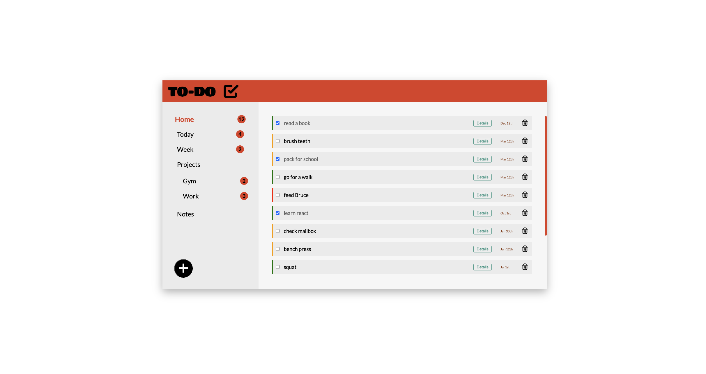

# 📝 To-Do List App

A fully functional to-do list manager built using vanilla JavaScript, HTML, and CSS. This app supports project-based task organization, localStorage persistence, dynamic DOM updates, and a responsive UI — all without any frameworks.



## ✨ Features

- 📁 Organize todos into custom projects (e.g., Gym, Work)
- ✅ Mark todos as completed with persistent checkbox state
- 📆 Assign due dates and set priority levels (Low, Medium, High)
- ➕ Add or remove todos and projects dynamically
- 💾 Data saved locally using `localStorage`
- 🧠 Intelligent default views: "Home", "Today", "Week"
- 🎨 Visual cues for selected project and priority levels


---

## 🛠 Technologies Used

- Vanilla JavaScript (ES6+)
- HTML5
- CSS3
- date-fns (for date formatting)
- Webpack (for bundling)

---

### 🔧 Installation

```bash
# 1. Clone the repository
git clone https://github.com/your-username/todoList.git
cd todoList

# 2. Install dependencies
npm install

# 3. Run in development mode (Webpack dev server)
npx webpack serve

# Then open your browser and go to:
# http://localhost:8000
```


